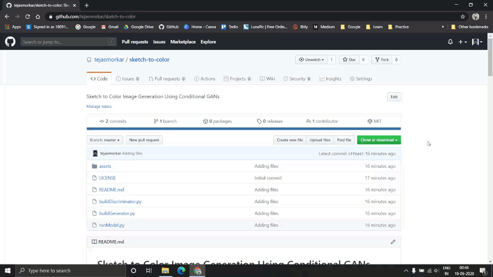

# Sketch to Color Image Generation Using Conditional GANs

## Read my article on [Medium](https://towardsdatascience.com/generative-adversarial-networks-gans-89ef35a60b69)

Sketch to Color Image generation is an image-to-image translation model using Conditional Generative Adversarial Networks as described in the original paper by Phillip Isola, Jun-Yan Zhu, Tinghui Zhou, Alexei A. Efros 2016, [Image-to-Image Translation with Conditional Adversarial Networks](https://arxiv.org/abs/1611.07004).

The model was trained on the [Anime Sketch-Colorization Pair Dataset](https://www.kaggle.com/ktaebum/anime-sketch-colorization-pair) available on Kaggle which contains 14.2k pairs of Sketch-Color Anime Images. The training of the model was done for 150 epochs which took approximately 23 hours on a single GeForce GTX 1060 6GB Graphic Card and 16 GB RAM.

## Table of Contents

1. [Requirements](#requirements)
2. [Usage](#usage)
3. [Future Works](#future-works)
4. [Credits](#credits)
5. [Send Me Queries or Feedback](#send-me-queries-or-feedback)
6. [License](#license)

## Requirements

To download and use this code, the minimum requirements are:

* [Python 3.6](https://www.python.org/downloads/release/python-360/) and above
* [pip 19.0](https://pypi.org/project/pip/) or later
* Windows 7 or later (64-bit)
  * [Microsoft Visual C++ Redistributable for Visual Studio 2015, 2017 and 2019](https://support.microsoft.com/en-us/help/2977003/the-latest-supported-visual-c-downloads)
* [Tensorflow 2.2](https://www.tensorflow.org/install/pip) and above
* [GPU support](https://www.tensorflow.org/install/gpu) requires a CUDA®-enabled card

## Usage

Once the requirements are checked, you can easily download this project and use it on your machine in few simple steps.

* **STEP 1**  
    Download this repository as a zip file onto your machine and extract all the files from it.

    

     

* **STEP 2**  
  Run the [runModel.py](./runModel.py) file using python to see the solution

  

   

> NOTE:
>
> 1 - You will have to change the path to dataset as per your machine environment on line #12. You can download the dataset from Kaggle at [https://www.kaggle.com/ktaebum/anime-sketch-colorization-pair](https://www.kaggle.com/ktaebum/anime-sketch-colorization-pair).
>  
> 2 - GANs are resource intensive models so if you run into OutOfMemory or such erros, try customizing the variables as per your needs available from line #15 to #19

* **STEP 3**  
  After the execution is complete, the generator model will be saved in your root direcrtory of the project as `AnimeColorizationModelv1.h5` file. You can use this model to directly generate colored images from any Black and White images in just a few seconds. Please note that the images used for training are digitally drawn sketches. So, use images with perfect white background to see near perfect results.

   

  You can see some of the results from hand drawn sketches shown below: 

  

## Future Works

I've been working on GANs for a lot of time and planning to continue exploring the field for further applications and research work. Some of the points that I think this project can grow or be a base for are listed below.

1. Trying different databases to get an idea of preprocessing different types of images and building models specific to those input image types.
2. This is a project applied on individual Image to Image translation. Further the model can be used to process black and white sketch video frames to generate colored videos.
3. Converting the model from HDF5 to json and building interesting web apps using [TensorFlow.Js](https://www.tensorflow.org/js).

## Credits

* some of the research papers that helped me understand the in-depth working of the Models are:

  * Ian J. Goodfellow et al. 2014, [Generative Adversarial Nets](https://arxiv.org/pdf/1406.2661.pdf)
  * Mehdi Mirza, Simon Osindero 2014, [Conditional Generative Adversarial Nets](https://arxiv.org/pdf/1411.1784.pdf)
  * Phillip Isola, Jun-Yan Zhu, Tinghui Zhou, Alexei A. Efros 2018, [Image-to-Image Translation with Conditional Adversarial Networks](https://arxiv.org/pdf/1611.07004.pdf)

* The code is based on [TensorFlow Tutorials](https://www.tensorflow.org/tutorials) avalaible on the website. The tutorials provided are intuitive and easy to follow.

* The dataset can be easily downloaded from Kaggle website at [https://www.kaggle.com/ktaebum/anime-sketch-colorization-pair](https://www.kaggle.com/ktaebum/anime-sketch-colorization-pair).

## Send Me Queries or Feedback

It is all opensource and for further research purpose, so contact me if you...

1. ...have some valuable inputs to share
2. ...want to work on it
3. ...find any bug
4. ...want to share a feedback on the work
5. ...etc.

Send me a mail at [tejasmorkar@gmail.com](tejasmorkar@gmail.com) or [create a new Issue](https://github.com/tejasmorkar/sketch-to-color/issues/new) on this repository.
You can also contact me through my [LinkedIn Profile](https://www.linkedin.com/in/tejasmorkar/).

## License

This project is freely available for free non-commercial/ commercial use, and may be redistributed under these conditions. Please, see the [license](./LICENSE) for further details.
